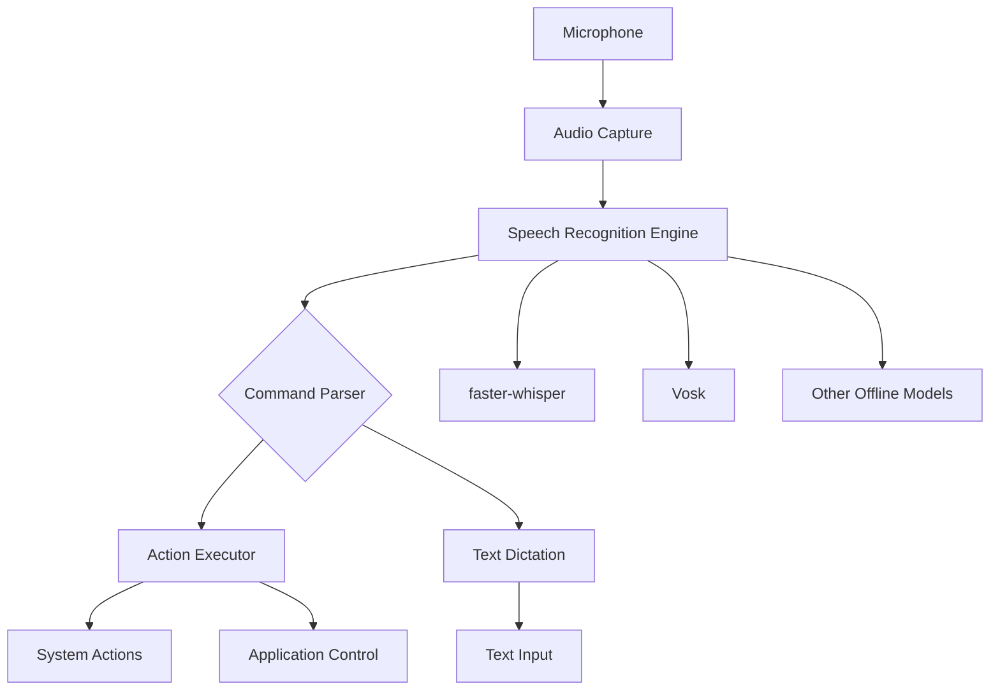

# Yawrungay - Voice Assistant

A privacy-focused, offline voice assistant inspired by [numen](https://git.sr.ht/~geb/numen). This project uses SpeechRecognition library backed by offline speech-to-text models (faster-whisper, vosk, or similar) to listen for commands and perform actions on your computer.

## Overview

Yawrungay is designed to be:
- **Privacy-first**: All speech processing happens locally on your machine
- **Lightweight**: Uses efficient offline speech recognition models
- **Extensible**: Easy to add new commands and integrations
- **Keyboard-friendly**: Can be triggered and controlled via voice or keyboard shortcuts

## Features

- 🎤 Voice command recognition using offline STT models
- ⌨️ Text-to-speech feedback
- 🔧 System automation capabilities
- 📝 Dictation mode for text input
- ⚡ Low latency response
- 🔒 No cloud dependencies

## Architecture



## Prerequisites

- Python 3.12+
- uv (package manager)
- Microphone input device
- Sufficient disk space for speech models (~100MB-2GB depending on model)

## Installation

```bash
# Clone the repository
git clone https://github.com/yourusername/yawrungay.git
cd yawrungay

# Install dependencies using uv
uv sync

# Activate virtual environment
source .venv/bin/activate  # Linux/macOS
# or
.venv\Scripts\activate     # Windows
```

## Configuration

Create a `config.yaml` file in the project root:

```yaml
# Speech Recognition Settings
stt_engine: faster-whisper  # Options: faster-whisper, vosk
model_size: small          # For faster-whisper: tiny, base, small, medium, large
model_path: ~/.cache/yawrungay/models

# Audio Settings
input_device: default
sample_rate: 16000
chunk_size: 1024

# Wake Word
wake_word: yawrungay
wake_word_sensitivity: 0.5

# Text-to-Speech
tts_engine: pyttsx3  # Options: pyttsx3, edge-tts
voice_rate: 180
voice_volume: 1.0

# Commands
command_timeout: 5.0
max_listening_duration: 30.0

# Logging
log_level: INFO
log_file: ~/.cache/yawrungay/logs/app.log
```

## Usage

### Basic Usage

```bash
# Run the voice assistant
python -m yawrungay

# Run with verbose logging
python -m yawrungay --verbose

# Run in headless mode (no GUI)
python -m yawrungay --no-gui
```

### Command Mode

When activated, Yawrungay can execute commands like:
- "Open [application name]"
- "Switch to [window name]"
- "Type [text]"
- "Press [key]"
- "Take screenshot"
- "Set volume to [0-100]"
- And more...

### Dictation Mode

Say "dictate" to enter dictation mode. Your speech will be typed directly into the active application.

## Supported Speech Recognition Engines

### faster-whisper
- High accuracy offline transcription
- Multiple model sizes available
- Good balance of speed and accuracy

### Vosk
- Lightweight recognition
- Fast initialization
- Good for real-time transcription

## Project Structure

```
yawrungay/
├── README.md              # This file
├── AGENTS.md              # AI agent guidance
├── pyproject.toml         # Project configuration
├── uv.lock               # Locked dependencies
├── src/
│   └── yawrungay/        # Source code
│       ├── __init__.py
│       ├── main.py       # Entry point
│       ├── audio/        # Audio capture and processing
│       ├── recognition/  # Speech recognition engines
│       ├── parsing/      # Command parsing
│       ├── actions/      # System automation actions
│       ├── tts/          # Text-to-speech
│       └── config/       # Configuration management
├── models/               # Speech model storage
├── logs/                 # Application logs
└── tests/                # Test suite
```

## Development

### Running Tests

```bash
uv run pytest
```

### Code Formatting

```bash
uv run ruff check src/
uv run ruff format src/
```

### Type Checking

```bash
uv run mypy src/
```

## Roadmap

- [x] Implement audio capture module
- [x] Add audio preprocessing utilities
- [x] Implement faster-whisper integration
- [x] Create YAML configuration system
- [x] Build CLI with test and transcribe commands
- [x] Add comprehensive test suite
- [x] Add Vosk STT engine support
- [ ] Create wake word detection
- [ ] Build command parsing system
- [ ] Add system automation actions
- [ ] Implement text-to-speech feedback
- [ ] Create GUI interface
- [ ] Add plugin system for custom commands
- [ ] Implement configuration wizard

## Inspiration

This project is inspired by [numen](https://git.sr.ht/~geb/numen), a voice-controlled assistant that prioritizes privacy and offline operation.

## License

MIT License - see LICENSE file for details.

## Contributing

1. Fork the repository
2. Create a feature branch
3. Make your changes
4. Run tests and linting
5. Submit a pull request
